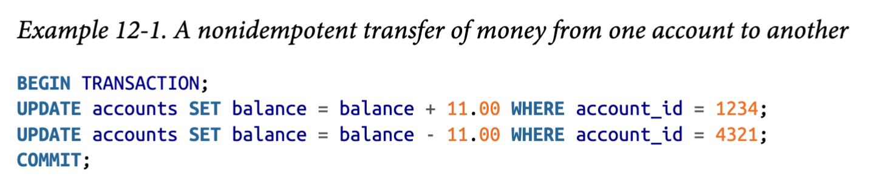

# Chapter 10: Batch Processing
- Unix provide simple tools for inputting and outputting data via pipes; a Unix process takes in some input and produces some output, but Unix standardizes the output formats so different processes can accept/transmit data
- Unix pipes provide a simple, easy way for inter-process communication
- MapReduce is a programming model rather than a usable system
- MapReduce is similar to Unix tools for data processing, but just distributed across nodes
- A MapReduce job is similar to a single Unix process, but parallelized over multiple nodes
- Unix uses stdin and stdout as input and output, whereas MapReduce jobs read and write files on a distributed filesystem
- Hadoop, a library implementation of MapReduce, implements MapReduce by using a distributed filesystem called HDFS as storage, and MapReduce jobs interact with this storage
- Hadoop replicates data across nodes for fault-tolerance
- MapReduce contains two steps
    1. The mapper is called once for every input record, and its job is to extract a key-value pair
    2. The reducer takes the values shared by same key, and iterates over them to produce a value
    3. Between the mapper and reducer is an implicit step that sorts keys from the mapper before sending to reducer
        - i. The sorting allows easy grouping of data to pass to reducer
- MapReduce systems provide APIs to implement MapReduce logic in conventional programming languages
- Hadoop MapReduce has a multi-step distributed execution flow
    1. A Hadoop MapReduce job takes in a file directory, and partitions each file or file block as its own map task to be executed on separate nodes
    2. The map tasks are typically ran on the same node that has the replicated file or file block to be processed, given there is enough RAM and CPU to fit data
    3. Application code for mapping and reducing is not on the actual Hadoop system, so the framework copies the code to the appropriate machines
    4. The output of the mapper are key-value pairs, and they are partitioned based on hash of key and written to sorted file on the mapper's local disk
        - i. This means for each key per map task, there exists a sorted file on that mapper's disk per key 
    5. Reducers connect to each of the mappers and download the files of partitioned, sorted key-value pairs
    6. The reducers then take the files from the mappers, which are grouped by key, and merges them together, preserving sort order
    7. The reducer is called with a key and an iterator that incrementally scans over records with the same key, and generate an output file on HDFS per reducer task with replicas on other nodes
- MapReduce is limited as a single job, so multiple jobs are chained where one job reads the files outputted by a previous job
    1. Various workflow schedulers scuh as Airflow and Pig allow managing multiple workflows efficiently
- An example of reduce-side joins is correlating user activity with user profile information, with user activity located in a log file and user profile located in a database
    1. It is too pricy to loop through each activity record and query the database, so the database is copied and extracted as files to the same HDFS cluster hosting user activity files
    2. Now, a MapReduce job can be used to join the two sets of data together for batch processing
    3. For the two sets of data, two mapper types are used (parallelized independently), and the reducer reads the key-value partition files from both sets of mappers
    4. The reducer now has all the values corresponding to key from both datasets, and join logic is now complete and aggregation/processing can be implemented
- A groupby is grouping records with the same key, and then performing some aggregation on the values within each group
    1. Simply make the group key the key in the key-value pair produced by mapper
    2. The reducers will then aggregate the values corresponding to the key
- Sometimes a key can be skewed, which means it occurs more often than other keys and can bottleneck the system with an overloaded reducer
    1. Certain higher-level MapReduce implementation libraries such as Pig, Hive, and Crunch handle skew by sampling which keys are hot, and then load balancing them across multiple reducers; a second MapReduce job is required to aggregate the first-stager reducer values into a single value per key
- Reduce-side joins perform actual join logic in reducers, and the mappers only take the key-value extraction + sorting role
- Reduce-side joins do not need to make assumptions about input, because the mappers prepare the data to be ready for joining, even if they are from heterogenous sources or formats
- However, reduce-side joins are slower due to more sorting and data copying
- Map-side joins requires making assumptions about input data, and ituses a MapReduce job with no reducers or sorting
    1. Broadcast hash joins assume joining a larger dataset with a smaller dataset by loading the smaller dataset into an in-memory hashmap for each mapper, and then partitioning the large dataset across mappers for joining
    2. Partitioned hash joins assume also partition the smaller dataset based on a partition key for the larger dataset, so a single mapper gets all records from both datasets sharing the same hashed key
- MapReduce was originally designed for making search indexes, where documents are processed and index files are generated via MapReduce jobs, allowing full-text search over a set of documents
- MapReduce outputs can be loaded into a database by using key-value stores such as Voldemort within the MapReduce job itself, and then copying the immutable output files to the database after the job is finished
- Hadoop MapReduce share similarities and differences with distributed databases
    1. Hadoop MapReduce provides a general "operating system" (or framework) that can run arbitrary programs with custom application code whereas MPP databases focus on parallel SQL query execution for analytics
    2. Databases requires data to adhere to schemas, whereas files in HDFS are just byte sequences and can be any data model or encoding
        - i. The mapper is what cleans this data up into a standardized form
    3. Hadoop is commonly used for ETL processes, because it take take a variety of data sources and load them into a specific, standardized form
    4. MPP databases only support query, so task-specific logic such as building search indexes or building machine learning systems cannot be expressed with SQL and must be coded up using MapReduce
    5. MapReduce tolerates faults by rerunning a map or reduce task at the granularity of an individual task
- MapReduce is simple to understand, but difficult to use because common functionality such as joins need to be implemented manually
- MapReduce jobs are independent, and they require the full output file of one job as input for another; this requires materializing the files rather than using an in-memory buffer to stream data between processes in Unix
- Some output files are only used by a single job, making output replication overkill for this intermediate state
- To combat these issues, new execution engines for batch processing such as Spark and Flink were developed, and handle an entire workflow as one job rather than having to define multiple MapReduce jobs 
    1. Dataflow engines that call a user-defined function to process one record on a single thread, and parallelize work over multiple nodes
    2. Functions are called operators, and not restricted to map and reduce
    3. Advantages include retaining intermediate state in-memory, limiting sorting only when absolutely necessary, and removing redundant map tasks because work done by a mapper in a dataflow engine can be incorporated into the preceding reduce operator
    4. For fault-tolerance, it is not as easy anymore because intermediate state is not materialized on HDFS, and so the data is less durable
        - i. Tolerate faults by recomputing lost data, which requires tracking how that data was computed through details such as partitions and operators
        - ii. However, if operator is not deterministic (statistical algorithms, hash table ordering randomness), then recomputing is pointless, because the original data might not be recovered
    5. In a sense, dataflow engines are like unix pipes, enabling easy bridging of operations together into a single job
    6. The output of dataflow engines is usually still materialized datasets on HDFS; so are the inputs
- Batch processing graph data requires implementing graph algorithms that are iterative in nature
    1. Running graph processing with MapReduce is not possible, because it only performs a single pass over the data
    2. An external scheduler runs a batch process to calculate one step of the algorithm, and runs another if some condition is not met, which is inefficient because of the continuous reading of entire input and outputting a completely new dataset everytime
    3. Pregel processing model is a bulk synchronous parallel (BSP) model of computation, and allows one vertex to send a message to another vertex, which is akin to MPNN layers in GNNs as more iterations means higher k-hop message aggregations
    4. Graph partitioning on a distributed processor is difficult, because it requires knowing what substructures to choose from in order to limit network overhead
        -i. If a graph can fit in-memory on a single node, it is higly likely a graph processing algorithm will run faster than Pregel, which operates in a distributed setting
- In the big data ecosystem, there are many tools, but they all fall into categories
    1. Every execution engine, and high-level is built upon the Hadoop platform, which consists; this is the Hadoop ecosystem
        -i. At a base level, Hadoop provides HDFS, YARN resource management, Hadoop Commons utilities, and MapReduce as the base execution engine
    2. On top of Hadoop is the execution engine controlling how data is processed, which can be the likes of MapReduce, Flink, Tez, and Spark
    3. On top of execution engines are query and workflow tools, which provide higher-level abstractions on how to transform data and setup complex workflows (multiple jobs); examples include Hive, Pig, Cascading, and Crunch
        - i. Typically use relational-style building blocks as computation
        - ii. By shifting the language to declarative queries, the underlying execution engine can optimize joins and other computations in their native way

# Chapter 11: Stream Processing
- A stream refers to data incrementally made available over time, such as in stdin and stdout of Unix
- In stream processing context, a record is more commonly known as an event, and usually contains a timestamp of occurrence
- An event is generated once by a producer (publisher/sender) and then potentially processed by multiple consumers (subscribers or recipients)
- Events are grouped into a topic or a stream rather than as a file in a filesystem in the context of batch processing
- In principle, a file or database is sufficient for producer and consumers, but they are not optimized for continuous polling by the consumer
- There are methods for direct streaming of events from producers to consumers, which means there is no intermediary node used in communication
    1. When a consumer dies, the consumer does not see data that was sent by the producer during the time it is down
    2. If the consumer is overloaded, the system can drop new messages from the producer, causing potential data loss
- A message broker is a database specialized for message streams, allowing producers and consumers to connect to it as clients, improving fault-tolerance of the system
    1. A message broker typically implements queues and provides additional features such as routing and pub/subscribers
    2. A message queue system typically has less features, but many people conflate the two terms 
- Consumers are generally asynchronous due to the queuing behavior of the broker, and producers only waits for broker to confirm it has buffered the message rather than waiting for consumer success
- Although message brokers store data, and some persist data for a while, they still differ from traditional databases; the message broker systems here are AMPQ-style and JMS-style message brokers
    1. Message brokers automatically delete a message when it has been delivered to its consumers (or it has an eventual garbage collection process)
    2. Message brokers do not support index search optimizations like databases
    3. Message brokers do not support queries, they only provide the events in order of generation due to the queue structure
- When there are multiple consumers reading from the same topic, an event can either be load balanced to a single consumer, or fan-out delivered to all consumers
- A client must explicitly tell the broker when it has finished processing a message for the broker to remove it from the queue, making the system fault-tolerant
- Unlike AMQP-style and JMS-style message brokers, log-based message brokers combine durable storage of databases with low-latency notification facilities of messaging
    1. Remember a log is an append-only sequence of records on disk
    2. Logs can be partitioned across nodes, so each partition is a separate log
    3. Topics group partitions that carry messages of the same type
    4. Messages per partition are monotonically ordered by ID, so they are totally ordered per partition, but there is no ordering gaurantee across partitions
    5. Kafka is the prime log-based message broker example
    6. Log-based brokers support fan-out messaging easily because consumers can indepnedently read logs without affecting each other; reading an event does not delete it from log
    7. For load balancing, partitions are assigned to nodes in a consumer group, so each consumer within the group consumers all messages in the partitions it has been assigned
        - i. Number of nodes in a consumer group consuming a topic can be at most the number of log partitions in that topic, because messages within the same partition are delivered to the same node
        - ii. If a single message is slow to process, it will hold up subsequent message processing in that partition
    8. The message broker behaves like a leader database, and the consumer like a follower in the context of consumer offset being similar to log sequence number of single-leader database replication
        - i. Log sequence number allows disconnected follower nodes to replicate without missing any writes
        - ii. Consumer starts consuming messages with an offset greater than the consumer offset, and this allows other nodes to pickup a down consumer and prevents messages from being skipped
    9. A log can get full, so old segments will need to be eventually deleted or extracted to archive storage; however, deployments rarely use full write bandwidth of the disk, so the log can typically keep a buffer of days' or weeks' of data
    10. Unlike AMPQ-style and JMS-style brokers, a consumer offset can be manipulated by a user to look at older messages
    11. Log compaction throws away duplicate messages by key, and keeps only the most recent update for each key
- Databases also take inspiration from stream processing
    1. A replication log is technically a stream of database write events, produced by the leader as it processes transactions
- A common problem where databases take inspiration from message systems is syncing heterogeneous data systems
    1. For instance, an OLTP database for an application could be supported by a search index, a cache, and a data warehouse; syncing these auxilliary systems manually with code logic is difficult due to race conditions
    2. CDC is the process of exposing data changes written to a database and streaming them to a log in which they can be replicated to other systems
    3. In a sense, the database is a producer of events (data changes), and auxilliary systems such as search indexes are consumers of those events
    4. Examples of CDC exposing a database's log include Mongoriver, Debezium, and Bottled Water for MongoDB, MySQL, and PostgreSQL respectively
    5. Other databases are starting to support change streams as a first-class interface
- A mutable state is the accumulation of an append-only log of immutable events
    1. As such, any durable changelog can make any state reproducible on any system because the log is the single source of truth
    2. It also allows for auditability since events are never removed but overwritten by newer events
    3. However, an immutable log may grow prohibitively large, and the performance of compaction and garbage collection becomes crucial for operational robustness
- Processing streams consist of one or more processing input/output stages before arriving at a final output
    1. It is similar to Unix processes and MapReduce jobs, but the input and output are live streams that don't have a fixed size
    2. Complex event processing (CEP) is an approach that allows users to use a high-level declarative langauge like SQL or GUI to describe patterns of events; as data is streamed into the system, it will try to match it with the stored queries for pattern detection
    3. Stream analytics is similar to CEP, but it tends to focus more on aggregating values and comptuing statistical metrics over a stream of events rather than finding event sequences of patterns
        - i. Common systems include Apache Flink, Storm, and Kafka streams, and Spark streaming
    4. When it comes to time, stream processing uses local system clock of the processing machine to determine windowing, and is reasonbale if delay between event creation and event processing is negligibly short
    5. But, if processing lag causes processing to happen way later than the time the event occurred, then the processed results would be inaccurate; events can also be out of order due to concurrency issues and race conditions
- There is the same need for joins on streams as there is for batch processing
    1. There are three different join on streams
        - i. Stream-stream joins
        - ii. Stream-table joins
        - iii. Table-table joins
    2. Stream-stream joins brings together two event streams within a specific time window, an this is implemented by managing a state in the stream processor using an index on the join key for both streams
    3. Stream-table join is very similar to stream-stream join in the sense that the database is stored as a copy on the stream processor, and a table changelog stream is used to keep this copy up to date
    4. Table-table joins takes two input streams as database changelogs, and a change on one table is joiend with the latest state of the other side, resulting in a stream of changes of the two joined tables' materialized view
    5. All three types depend on requiring stream processor to maintain some state based on one join input, and query taht state on messages from the other join input
- Unlike batch streaming where faults are restarted at the map or reduce level, and thus outputting only when task is finished, stream processing cannot hang for task completion because streams are infinite and processing is continuous
    1. One solution is to microbatch streams into small blocks, and treat each like a small batch process in the context of fault-tolerance
    2. Another approach is to periodically checkpoint points of state by writing them to durable storage for fallback in case of crash
    3. The two solutions above adhere to the exactly-once semantics of batch processing and its fault tolerance mitigation principles; but, it does not revoke failed batch outputs sent to downstream systems
    4. For state rebuilding after stream process failiure, many systems use snapshots by writing to disk, or by replicating state and processing on multiple nodes

# Chapter 12: The Future of Data Systems
- Derived data is a common issue in distributed architecture, because a single logical set of data can be represented in multiple systems
    1. For instance, an application might have a SQL database, and a full-text search index that is derived from the database to provide efficient text search features; the architecture may have more data systems relying on derived data such as caches, data warehouses, or ML systems
    2. If user input is funneled through a single system that decides on an ordering for al writes, it is easy to keep derived data consistent; for instance, CDC can be used on a database
    3. Distributed transactions can be used to sync heterogeneous data systems together through 2PL, but it lacks the performance of the asynchronous streamed derived data; however, distributed transactions do provide gaurantees of linearizability
        i. Linearizability versus total ordering
    4. If total order broadcast is not pursued, it can be difficult to capture all casual dependencies, especially if there are multiple data systems involved
- When maintaining derived data systems, asynchrony is what makes systems basd on event logs robust as it allows one fault in one part of the system to be contained locally; distributed transactions will abort if any participants fail
- Batch and stream processing are useful in creating derived views of data, and provides a good mechanism for evolving system to support new features and changed requirements
    1. Rather than migrating the original source of truth, a derived view can be created with modifications and then A/B tested with a small subset of users
- Lambda architecture proposes incoming data should be recorded by appending immutable events to an always-growing dataset; from here, read-optimized views are derived
    1. Runs batch and stream processing systems in parallel
    2. Stream processor consumes events and produces an approximate derived view, and then the batch runs periodically on the same set of events and corrects the derived view
        - i. Stream processing is more prone to fault-tolerance than batch systems
- Unbundling data systems is the act of using log-based integration or stream processing to create derived views rather than using distributed transactions
    1. When one dataset is derived from another, the derived data can be thought of having went through a transformation function with respect to the original data
        - i. Deriving a secondary index is so common that there is an abstraction to do so with CREATE INDEX
        - ii. However, most derived data require custom application logic and code to do so, which poses challenges
        - iii. Derived systems require more gaurantee such as stable message ordering and complete fault tolerance, some of which are not common in messaging systems; however, these gaurantees are still cheaper than distributed transactions
- Tracing a set of derived data systems requires breaking down the write path and the read path, that is, the order of services edited or queried to bring the entire system and any downstream derived data up to date
    1. Caches, indexes, and materialized views all shift the boundary between the two paths by lengthening the write path (precomputation of results) and shortening the read path
        - i. A nice way of thinking about write versus read performance
- Traditional derived data systems extend the write path to a materialized view such as a cache, and allow the read to query and return a response; however, it is possible to represent reads as a stream as well and send both read and write events to a stream processor
    1. This would be a stream-table join, where the table is in the form of an event log
    2. Recording a log of read events would benefit casual dependency tracking, but could incur additional storage and I/O cost
    3. It becomes more challenging when the database is partitioned, and would require a sequence of stream-table joins with multiple partitioned datasets (multiple event logs)
- Exactly-once semantics states if a fault occurs, the output generated looks as if there were no faults associated, even if the processing was retried
    1. Processing twice is a form of data corruption, such as charging a customer twice or incrementing a counter twice
    2. Exactly-once semantics avoids nasty side effects of excessive processing
    3. Idempotence (same effect, no matter how many rounds of execution) can be used to achieve exactly-once semantics by preventing retried operations from compounding changes in the system
    4. 
    5. Solving the duplicate transaction suppression problem to gaurantee exactly-once semantics is challenging, because it involves making changes from the database to the end-user client and all systems in between
        - i. It requires an end-to-end solution
- Uniqueness constraint is the gaurantee of identifiability with unique keys
    1. Easy to address with single-leader replication, but falls apart if other forms of replication are used, which can cause concurrency issues and race conditions leading to data inconsistency
    2. Partitioning would work if the unique value is the partition key
- In distributed systems, timeliness and integrity are important
    1. Timeliness is the measure of how long data is kept in an inconsistent state until updated to represent single source of truth
    2. Integrity measures a systems tendency for corrupt data, data loss, or contradictory/false data
    3. Timeliness is annoying but eventually solvable, whereas integrity is a permanent issue if not addressed
    4. It is easy to use ACID transactiosn to provide both
    5. However, unbundled, event-based systems with asynchronous event stream processing struggle to gaurantee timeliness; but, exactly-once semantics can preserve data integrity, and can be achieved through fault-tolerant message delivery and duplicate suppression via idempotence
- Building systems is based on a set of assumptions
    1. For instance, assume nodes can crash, networks can lag, and concurrency can occur; but assume fsync works, that CPU always computes the right result, and memory is not corrupt
    2. However, this is binary assumption making is not entirely accurate, as it is more a question of probabilities where some things are more likely than others to happen
    3. Hardware bugs are an issue, but software bugs also happen such as MySQL not enforcing a primary key uniqueness constraint correctly for some reason
    4. As such, it is good for a system to self-audit its own data, and this is where event-based systems are good because the log is the audit whereas for database transactions, it is hard to pinpoint the cause of a set of changes or edits
    5. This auditing should be done in end-to-end fashion to limit undetected corruption
- Software is built for a purpose, and it is its usage that dictates how ethical it is, an issue that is not prioritized by many engineers and companies
    1. ML models are a great example of ethics, because bias in data can influence predictions such as criminal offense
        - i. For instance, because many African Americans in the training set offend, the model is biased towards this racial group, and falsely accuse someone of a crime simply bby race
        - ii. If there is a systemic bias in the input to an algorithm, the algorithm will most likely learn and amplify that bias in the output
    2. It is difficult to take ownership of ethical issues caused by software, because blame can be assigned in multiple areas such as data bias, human bias, company goals, or unforeseen system bugs
    3. Privacy and data tracking is another large ethical issue, because there isn't a distinguished line between violation of privacy and harmless data collection in the digital world
        - i. Replace the word data with surveillance, and analyze the tenor of a phrase

