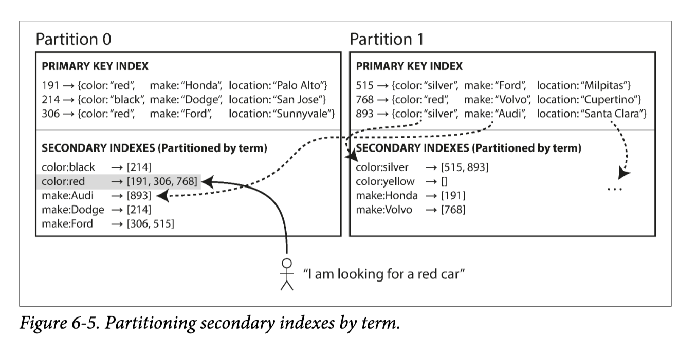

# Chapter 5: Replication
- Replication means keeping a copy of the same data on multiple nodes connected via a network, increasing availability and making system more fault-tolerant
- Each node that stores a copy of data is called a replica; the number of nodes storing replicas is called the replication factor
- Every write to the database needs to be processed by every replica, and the most common solution is master-slave replication
    1. This is a single master and multiple followers/slaves/replicas
- Writes are always handled by master, and then changes are propagated via a change log by the followers
- Replication could be synchronous or asynchronous
    1. Synchronous means when a write is processed by master, the master waits for changes to propagate to all followers before returning a success
        - i. This ensures high consistency but low availability because if one replica fails, it stalls the entire write operation
    2. Asynchronous means when a write is processed by master, the master instantly returns and the replication is done at some time in the future
        - i. High availability but eventual consistency and low durability if master dies before changes are propagated
        - ii. This is the most common apporach to master-slave architectures
- In master-slave architecture, adding a follower simply means using a snapshot of the master's log and applying it, and then removing the discrepenacy in the replica logs post-snapshot
- On a follower failure, each follower has a copy of a change log, and so if a follower goes down, it can contact the master for the latest change log and merge
- On master failure (failover), a new leader must be elected and the application must be reconfigured to use this new leader for writes as well as ensuring followers replicate this leader
    1. If asynchronous replication is used, new leader may not have received all writes from the old leader before it failed; if old leader is up again, then these old writes could conflict potentially with newer writes on the new leader
    2. As such, some operation teams prefer to perform failovers manually
- Leader-based replication works using logs
    1. The master logs every write request and sends that statement log to its follower such as INSERT, UPDATE, or DELETE for execution
        - i. This can be bad if a nondeterministic function such as NOW() is called
    2. Write-ahead log shipping is writing to an append-only sequence of bytes containing all writes, which is then sent over to followers
        - i. WAL contains details of which bytes were changed in which disk blocks, so if a database changes its storage format frmo one version to another, it is not possible to run different versions of database software on the leader and followers
    3. Logical (row-based) log replication is decoupling log formats for replication from the storage engine itself
        - i. Logical log is a sequence of records describing writes to database tables at the granularity of a row
        - ii. The log is sent to followers for replication
- Replication naturally has lag because any data transmission over a network naturally has latency
    1. In asynchronous replication master-slave architecture, reads are eventually consistent as writes might require some time to propagate to all replicas
- Replication lag can be grouped into three main problem categories
    1. A user should be able to have their own writes be consistent, and this is called read-after-write consistency
    2. Because replicas have different lag times, a user executing two queries may have one query be consistent but the other not have any data yet, meaning the user is backwards in time
        - i. Ensuring monotonic reads means sequential queries should not read older data after previously read newer data
    3. Because replicas have different lag times, a sequence of writes/reads that depend on eachother in a specific order is not gauranteed; gauranteeing this causality means having consistent prefix reads
- Master-slave architecture is not fault-tolerant to a slow leader, as writes will not be able to go through; as such, master-master or multi-leader replication is used
    1. Master-master is almost always used in multi-datacenter setups rather than single datacenter setups
    2. One leader per datacenter, and followers within that datacenter follow their leader
    3. Leader conflicts are resolved among eachother
    4. Write requests can go to their local datacenter's leader
    5. Master-slave requires failover when a leader fails, but in master-master, the system can continue serving writes
    6. Due to issue of having writes occur in different places and thus causing consistency issues, master-master architecture should be avoided if possible
        - i. Could make writes synchronous by having writes propagate to all leaders, but this defeats the master-master purpose
        - ii. Could avoid conflicts by serving read-writes from the same leader in a datacenter for a particular record/user; this seeks to avoid conflicts in the first place but implies data loss
        - iii. Could give each write a unique ID and pick the write with the highest ID as the winner (last write wins - LWW)
        - iv. Could give each leader a unique ID and let writes that originated at a higher-numbered leader win but implies data los
        - v. Somehow merge the conflicting values together
    7. However, master-master architecture philosophy does have some use cases
        - i. A client writes to and reads from their calendar from an offline device, which acts as the local database and also the leader; when online again, an asynchronous mult-leader replication process between the replicas (devices) happens and changes are merged with conflicts handled correctly
    8. Master-master architecture can have different topologies, which mean the direction of replication flow in leaders
        - i. Most setups use all-to-all topologies, which means each leader propagates its writes to all other leaders
- Leaderless replication (masterless/peer-to-peer replication) allows any replica to accept writes from clients, and it has been popularized by systems such as Cassandra and DynamoDB
    1. There is no failover because there is no leader to promote in case of leader failure
    2. Writes and reads are sent to replicas in parallel
    3. When a replica is down, new data is written to other online replicas, while the failed node remains stale
    4. Mechanisms are used for synchronizing stale data with single source of truth
        - i. Read repair uses versions associated with values, and stale versions are updated with the latest read version
        - ii. Anti-entropy uses a separate background process to periodically query and identify differences in data between replicas; the order of writes is not preserved
        - iii. Note that without an anti-entropy process, values that are rarely read may be missing from some replicas and thus have lower consistency than that of frequently read values
    5. Quorum is a measure of minimum number of successes for read or write to be valid
        - i. Obeying quorum generally ensures a level of data consistency in the sense that one read is gauranteed to have the most up-to-date data
        - ii. The equation is w + r > n
        - iii. Increasing w decreases write speed and increasing r decreases read speed
        - iv. Quorum is a theoretical law, but due to practicalities such as concurrent reads/writes and node faults, quorum's gaurantee is not fully absolute
    6. Quorum can lead to unavailability when a large number of nodes cannot receive reads or writes, so use sloppy quorums
        - i. Sloppy quorums accept writes to nodes that aren't among the replicas of the database
        - ii. In this setup, additional nodes outside of the replication factor act as temporary storage for new writes
        - iii. Once network interruption is fixed, any writes that one node temporarily accepted on behalf of another node are sent to the appropriate node the write was originally supposed to go to; this is known as hinted handoff
        - iv. Sloppy quorum increases write availability at the cost of data consistency
    7. Write conflicts may occur which leads to inconsistent data that must be resolved via mechamisms
        - i. LWW attaches timestamps to each write, and picks the biggest timestamp as the most recent, and discards any writes to the same key with an earlier timestamp;  LWW helps with eventual consistency, but at the cost of data durability because older writes are lost forever
        - ii. Several casually dependent writes can create a group of values, but this chain can be concurrent with another chain, and these sibling chains can be merged via union; deleted keys are marked with tombstones
- Conflicts can either be concurrent or casually dependent
    1. Casually dependent means operation A must know about B; concurrent means A and B do not know about the other
    2. An algorithm is used to determine concurrent versus casually dependent operations; this is for a single replica
        - i. The server maintains a version number  for every key, increments the version number every time that key is written, and stores the new version number along with the value written
        - ii. When a client reads a key, the server returns all values that have not been over‐written, as well as the latest version number. A client must read a key before writing.
        - iii. When a client writes a key, it must include the version number from the prior read, and it must merge together all values that it received in the prior rea- iv. (The response from a write request can be like a read, returning all current values, which allows the chaining of several writes like in the shopping cart example)
        - iv. When the server receives a write with a particular version number, it can over‐write all values with that version number or below (since it knows that they have been merged into the new value), but it must keep all values with a higher version number (because those values are concurrent with the incoming write)
    3. Version vectors, a collection of versions from each replica, are used in a leaderless setup with multiple replicas
        - i. The algorithm for detecting concurrency is still highly similar as clients provide a version number when writing; reading provides clients with a version number (the write response can do similar)

# Chapter 6: Partitioning (Sharding)
- Partitioning involves splitting a database into multiple smaller databases for scalability
- Partition and replication usually go together
    1. Partitioning is usually combined with replication, so each partition can be replicated on other nodes
    2. A node may store more than one partition
    3. The choice of partitioning scheme is mostly independent of the choice of replication scheme, because replication of databases applies equally to replication of partitions
    4. From the lens of replication, each partition is an independent database
- In an ideal world, data should be evenly sharded to ensure each node can have read and write throughput maximized
- Partitions can be governed by key ranges
    1. Ranges do not have to be equal, because some bins might have larger loads than others
    2. Each partition can be indexed in sorted order for range queries
    3. Key range partitioning can lead to hot spots if one range is active while other nodes remain idle
- Partitions can be governed by key hashes
    1. A good hash function takes skewed data and uniformly distributes it
    2. Assign each partition a range of hashes (rather than a range of keys), and every key whose hash falls within a partition's range will be stored on that partition
    3. Similar data are no longer witin the same node, so range queries cannot be optimized with indexes; this is offset by the fact that skew is no longer as much of an issue
- Skew and hot spots are not entirely avoidable given edge case situations such as celebrity followers; the application must handle edge cases because data systems don't have a robust way of dealing with this
- Secondary indexes don't map neatly to partitions, so there are two main approaches to partitioning a database with secondary indexes
    1. The reason behind this is because the values that secondary indexes monitor are possibly scattered across different partitions; this is different than a key and a primary index on that key because all values of the primary index are on the same partition
    2. Document-partitioned indexing means managing local, independent indexes per partition
        - i. Searching on the index requires querying all partitions and combining results, which is called scatter/gatther and can be expensive
    3. Term-partitioned indexing constructs a global index for data in all partitions, but the global index must also be parititoned because a single node cannot hold such size; the global index is partitioned by term on the same set of nodes of the partitioned database, but a global index partition is partitioned independent of the primary key index
        - i. 
        - ii. For example, one node can hold secondary indexes for terms A-Z or hashes 0-1000 (range versus hash based partitioning benefits apply here too)
        - iii. Reads are not more efficient than doing scatter/gather but writes are slower because a write to a single partition may now affect multiple partitions of the index
        - iv. Global secondary indexes are updated asynchronously
- Rebalancing means assigning partitions to nodes and requires meeting several criteria
    1. Load should be shared fairly between nodes in cluster
        - i. Data size, read and write throughput, etc
    2. Database should be available while rebalancing is happening
- There are several strategies for rebalancing partitions, and some work for both key and range partitioning while others do not
    1. A fixed number of partitions means creating more partitions than there are nodes; when a new node is added, it will sample some number of partitions from other nodes; while data is being migrated, read and writes are served through old partitions, gauranteeing availability
    2. Dynamic partitioning creates more shards when a partition gets too big
    3. Node proportional partitioning fixes the number of partitions per node, and only allows new partitions when a new node joins the cluster
- Routing to the correct partition based on request can be done via random node selection, a routing tier, or a client-aware method
    1. Different databases use different routing methods based on these three foundations

# Chapter 7: Transactions
- Transactions mainly deal with concurrency issues surrounding multiple users writing and reading to the same, local database node and to the same object(s), which is different from replication concurrency issues that are across nodes
- A transaction is a group of several reads and writes that are either gauranteed to succeed or fail with no partial results
- Almost all relational databases and some nonrelational databases support transactions
- Transactions theoretically gaurantee ACID, which means atomicity, consistency, isolation, and durability
    1. Atomic means something that cannot be broken down into smaller parts
        - i. For multithreading, an atomic operation cannot be seen half-finished by another thread
        - ii. For databases, an atomic operation is a sequence of writes that are grouped together so it can either fully complete or not execute at all
    2. Consistency means certain statements about data must always be true, which depends on the context of the data and the logic surrounding it; it does not mean consistency in the context of CAP for distributed systems
    3. Isolation ensures concurrently executing transactions are isolated from each other
    4. Durability is the promise that after transaction completion, written data is never forgotten even in the case of faults; this means writing to SSD/disk or involving a write-ahead log to store in-memory data not yet committed to disk
        - i. Perfect durability does not exist because theoretically, all hard disks can be wiped simultaneously in a data system
- Multi-object operations are those that modify several objects (rows, documents, records) at once
    1. Multi-object transactions are used to keep multiple pieces of data in sync (atomicity) and gaurantee other transactions see consistent data (isolation)
    2. Multi-object determine which transaction owns a set of read and write operations using a client's TCP connection to the relational database
- Single-object operations modify a single object (rows, documents, records)
    1. Single-object transactions aim to provide atomicity and isolation on one node and is almost universal to all database engines because a single object write must be atomic; it would not make sense to have a partially created record
- Transaction isolation comes in multiple levels of robustness that prevent against several types of race conditions
    1. Serializable isolation gaurantees transactions have the same effect as if they ran one at a time
        - i. Under the hood, the database may still run transactions concurrently for optimization, but it ensures the output will always match the output of a non-concurrent execution scheme
        - ii. High performance cost for strong consistency and enforces all aspects of ACID
        - iii. Serial execution can achieve serializable isolation, which is running small, fast transactions on a single thread; this offers no concurrency
        - iv. Two-phase locking (2PL) uses object locks where writes block both readers and writers and vice versa; this is different from snapshot isolation, where locks only block writes and not reads
            i. Two transactions can be holding object locks that depend on eachothers release, so database engines automatically detects these deadlocks and aborts one transaction to further progress
            ii. Predicate locks are used for write skew and phantoms, where the initial query must acquire a shared-mode predicate lock; this ensures other transactions that may modify the query commit before the query is ran
            iii. Predicate locks do not perform well, so 2PL introduces a simplified version called index-range locks, which lock a larger subset of the objects a query returns; for instance, locking all bookings between noon and 1 PM or in room 123 at any time rather than room 123 between noon and 1 PM 
    2. Read committed gaurantees reads only see committed transaction data and and writes only overwrite data that has been committed
        - i. Default setting for MemSQL, PostgreSQL, and many other databases
        - ii. For dirty write prevention, object-level locks are acquired by a transaction and only released when transaction commits or aborts
        - iii. For dirty read prevention, object-level locks would slow reads if a long-running write transaction was occupying the lock, so databases remember the old value that is being written and returns this to user, swapping over to new value if transaction succeeds
            i. For databases that support snapshot isolation, MVCC is used for preventing dirty reads as well
        - iv. Read committed causes read skew and nonrepeatable reads
    4. A stronger isolation level preventing read skew and nonrepeatable reads is snapshot isolation
        - i. Read skew generally involves a transaction reading two or more related pieces of data (often multiple rows) that were committed in an inconsistent way, giving the reading transaction a partial or skewed view of related data
        - ii. Nonrepeatable reads involve a transaction reading the same row more than once and getting different values because another concurrently executing transaction overwrites and commits the value
        - iii. Snapshot isolation (also known as repeatable read) gives each transaction a consistent snapshot of the database by seeing all versions of data previously committed at the start of a transaction
        - iv. Snapshot isolation uses row-level write locks to prevent dirty writes, but does not use locks for reads in order to handle long-running read queries while processing new writes
        - v. Snapshot isolation uses MVCC for implementation
            - a. Assign an increasing transaction ID per transaction
            - b. Any write operation marks a row with the latest transaction ID as deleted by the newer transaction ID, and creates a new row marked as created by the newer transaction ID
            - c. Any reads can only read from rows that have a committed transaction ID < their own transaction ID
            - d. Marked rows for deletion are deleted periodically via garbage collection process
    5. Read committed and snapshot isolation levels handle read inconsistencies, but don't handle write inconsistencies such as lost updates
        - i. Lost updates occur when an application reads from value from the database, modifies it, and writes back the modified value in a read-modify-write cycle; if two transactions perform this concurrently, one of the modifications can be lost
        - ii. Many databases provide atomic update operations to remove read-modify-write cycle implementation in application code, and this is typically achieved with object locks
        - iii. Some write operations are too complex to be captured by a database's native atomic update operation, and so an explicit lock can be used in the transaction to lock the object(s)
        - iv. Databases without transactional support use compare-and-set operations, which only updates values if the value is the same as when first read
        - v. In a replicated database environment, explicit locks and compare-and-set do not work because there is not a gauranteed single up-to-date copy of data; native atomic operations are more suitable
    6. Write skew are a generalization of the lost update problem
        - i. Two transactions read the same object and updates different objects based on information from the read object; this leads to inconsistencies between the two objects
        - ii. Atomic operations don't help as multiple objects are involved
        - iii. Serializable isolation prevents write skew, but at the cost of latency
        - iii. Write skew is not automatically detectable unless serialization is active
        - iv. Solve write skew by explicitly locking rows that the transaction depends on if serializable isolation is not enabled
        - v. Phantoms are a subset of write skew where reads do not return any data, so explicit locks cannot be used to handle them
        - vi. A last resort for solving phantoms is to artificially introduce lock objects into the database so that explicit locks can be used as read queries return data; this is hard to code and prone to error
    7. Serializable snapshot isolation (SSI) are a newer isolation level with a novel approach to solve consistency and performance tradeoffs between weak isolation and serializability
        - i. 2PL is a pessimistic concurrency control mechanism, where locks prevent issues from happening
        - ii. SSI is an optimistic concurrency control mechanism, where transactions are not locked, and are aborted and retried by the database if a race condition occurs
        - iii. SSI performs badly when there is high contention, causing many transactions to abort and retry
        - iv. SSI is built on snapshot isolation, where all reads in a transaction are made from a consistent snapshot of the database
        - v. SSI detects stale MVCC reads and uses index-range locking for write skew issues
        - vi. SSI prevents reads and writes from blocking each other with locks such as in 2PL, and is more scalable than serial execution in terms of core usage; it is slowed by abortion rate
    8. Race conditions can be summarized by reads and writes
        - i. Race conditions can happen with simultaneous writes
            - a. Dirty writes occur when a transaction writes to a row, and another transaction writes to the same row before the first can commit
            - b. Lost updates occur when a transaction writes to a row, and another transaction writes to the same row after the first commits; happens in the context of read-modify-write cycles
            - c. Write skews occur when one transaction modifies an object based on the results of a query, but the results of the query are not consistent as another transaction modifies the query objects
            - d. Phantoms are a subset of write skew where the query result could be empty, and a write is performed due to this
        - ii. Race conditions can happen with simultaneous reads
        - iii. TODO FINISH SUMMARY OF CONCEPTS and ENSURE CONSISTENCY WITH NOTES ABOVE

# Chapter 8: The Trouble with Distributed Systems
- Faults in a single computer are deterministic because there exists only a total failure, unlike in distributed systems where the partial failures are unpredictable
- Distributed system faults are tricky because the fault can be caused by the network request/response or the target service being down; as such, it is impossible to tell the reason of the fault so timeouts are the default solution
- A small timeout detects faults faster but could cause incorrect fault declarations if node is under heavy load; a long timeout takes longer to detect faults
- Distributed systems rely on clocks for timeouts, metrics, replication strategies, and more
- Computers have two types of clocks
    1. Time-of-day clocks return current date and time since the epoch, which is midnight UTC on 1/1/1970 and are synchronized with NTP
        - i. Time-of-day clocks can desynchronize with NTP, and could possibly jump back in time to reach consistency
        - ii. Because of their ability to jump back in time, they are not suited for measuring duration
    2. Monotonic clocks are always moving forward and are used for measuring duration
        - i. The absolute value of a a single monotonic clock is meaningless and should not be compared against another computer's monotonic clock
        - ii. The difference between two values of a monotonic clock measures time elapsed
- Time-of-day clocks generate timestamps used for LWW in multi-leader and leaderless replication, but because node clocks can vary slightly, a write with a later timestamp might not actually have happened at a later time
    1. This could cause inconsistency issues with the LWW replication strategy
    2. A write that occurred later is overwritten by a write that occurred earlier because the earlier write had a later timestamp due to clock skew
- Time-of-day clocks can be used to assign monotonically increasing transaction IDs in snapshot isolation across a distributed database; Google's Spanner employs this strategy
- Just as now timing cannot be assumed with multi-threading on a single machine, timing cannot be assumed across a distributed system
- A system is Byzantine fault-tolerant if it continues to operate correctly even if some of the nodes are malfunctioning and not obeying the protocol, or if malicious attackers are interfering with the network

# Chapter 9: Consistency and Concensus
- The hiearchy of distributed consistency models is similar to that of transaction isolation levels, and they are mostly independently concerns
- Linearizability, also known as atomic consistency or strong consistency, makes system appear as if there were only one copy of data and all operations are atomic
    1. It is a recency gaurantee on reads and writes to an individual object in the database that is distributed
    2. Read and write operation orders must be connected by lines moving forward in time for a system to be linearizable
    3. A read returning a value X means all following reads must also return X even if a following read hit a node with stale data
    4. Linearizability is used in single-leader replication for leader election through a linearizable distributed lock, in creating uniqueness constraints in replicated databases such as ensuring balance does not go negative, and in manaing multiple communication channels
    5. Single-leader replication is potentially linearizable if reads are sent to a properly elected leader or synchronized follower
    6. Multi-leader replication is not linearizable
    7. Leaderless replication are not linearizable
    8. Multi-datacenter setups cannot provide linearizability because of network interruptions between datacenters
    9. Linearizability trades performance for strong data consistency 
- Ordering is important in the context of operations in databases
    1. Causality is an interaction between two events A and B such that if event B happens, event A must happen
    2. Causality imposes an ordering on events, where cause comes before effect
    3. Partial order is causality because two casually independent events cannot be ordered as there is no notion of it; linearizability defines total order though
    4. Linearizability implicitly ensures casual consistency but not vice-versa
    5. It is not needed to track all casual dependencies for casual consistency, as sequence numbers can be used to create a total order consistent with causality
        - i. In single-leader replication, the replication log defines a total order of write operations consistent with causality through a monotonically increasing sequence number for each operation in the replication log
        - ii. In multi-leader or leaderless replication, sequence number generation methods are not consistent with causality because of concurrency issues
        - iii. Lamport timestamps assign a counter and an ID for each node, and any node seeing a request with a higher counter updates to the current max seen, gauranteeing causal ordering of events
        iv. Lamport timestamps suffer if the finalization of ordering needs to be known
    6. To know when total order is finalized, total order broadcasting is used
        - i. A protocol for exchanging messages between nodes
        - ii. No messages are lost with reliable delivery; if one is delivered to a node, it is delivered to all nodes
        - iii. Messages are delivered to every node in the same order
        - iv. Total order broadcasting is essentially a way of creating a log, where delivering a message is like appending to the log
- Consensus is the idea of enabling multiple nodes to agree on some operation, task, or choice
    1. Distributed atomic commit cannot be solved by sending same transaction to each node because a failed transaction would cause data inconsistency
    2. Distributed atomic commit should rollback all changes on all nodes if an error occurs; no transaction should be committed because it is impossible to abort a committed transaction
    3. Two-phase commit (2PC) is an algorithm for achieving atomic transaction in a distributed database
        - i. It uses a coordinator or transaction manager that prepares each transaction by verifying correctness, and then committing them atomically
        - ii. The preparation and commit stages are atomic; the preparation stage is fault-tolerant because if it replies "yes" to all transactions, it loses the privilege to abort
         -iii. The commit stage only commits if the transactions are written to log on disk for recovery and atomicity
        - iv. 2PC's coordinator is a single point of failiure, because clients need to wait for the coordinator to recover if it goes down; this is a blocking atomic commit protocol
    4. Distributed transactions stall performance greatly, so they are advised against in general
    5. Distributed transactions are either database-internal or heterogeneous, which means the consistency of database software ran on each node; 2PC is implemented differently for the two transaction types
    6. Heterogenous distributed transactions are implemented with XA transactions, which is a C API for interfacing with a transaction coordinator
    7. When a coordinator crashes, any locks used in transaction isolation levels are not released, causing application to become unavailable until coordinator is online again
- A consensus means getting several nodes to agree on something
    1. A consensus algorithm decides on values proposed by multiple nodes
    2. It states that no two nodes decide differently nor twice, a decided value must be generated by a node, and every node that does not crash eventually decides some value
    3. Eventual consensus provides fault-tolerance, beacuse a consensus algorithm cannot sit around and do nothing forever when a node fails; other nodes continue to make progress by making decisions
        - i. 2PC does not reach eventual consensus because a dead coordinator stalls the entire system from making decisions
    4. Fault-tolerant consensus algorithms/protocols include VSR, Paxos, Raft, and Zab, and they differ from the formal model rules described previously
    5. They decide on a sequence of values, which makes them total order broadcast algorithms; at a high level, nodes propose messages and then decide on the message to send via multiple rounds of consensus where nodes deliver messages in same order, and messages are not duplicated, corrupted, or lost
    6. Single-leader replication with automatic failover poses a conundrum as nodes need to agree on who a leader is, which requires consensus, which requires a leader
    7. Consensus protocols define an epoch number where in each epoch, the leader is unique
    8. Each new leader is given a monotonically increasing epoch number, and if two leaders are alive, the one with the larger number prevails
    9. A leader must check if there isn't another leader with a higher epoch number by garnering votes from nodes that are unaware of any other leader with a high epoch
    10. This leads to two rounds of voting, one to choose a leader, and a second to vote on a leader's proposal
- ZooKeeper or etcd are distributed system coordination services, and they act as distributed key-value stores but with consensus implementation
    1. It is rare to use these services directly, but other common systems use it such as Kafka, Hadoop Yarn, and Kubernetes
    2. They are distributed in-memory stores with replication adhering to fault-tolerant total order broadcast algorithm
    3. ZooKeeper and etcd outsources the work of coordinating nodes such as consensus, operation ordering, and failiure detection to an external service
    4. Applications that use coordination services register to the service and retrieve or send coordination information amongst eachother through this central hub