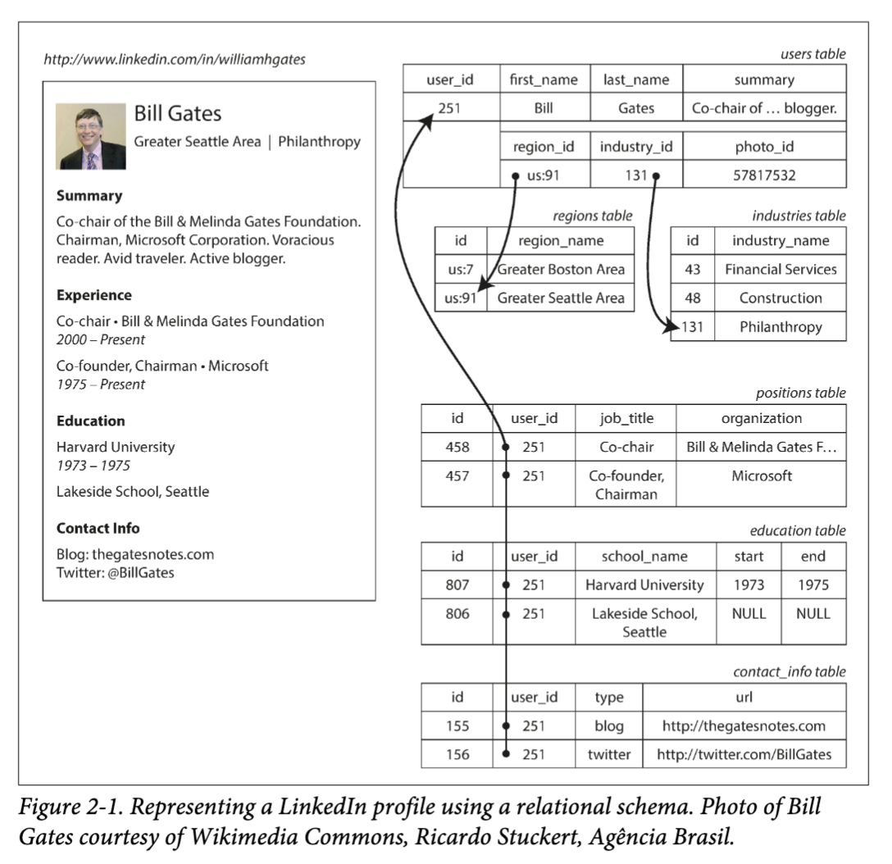
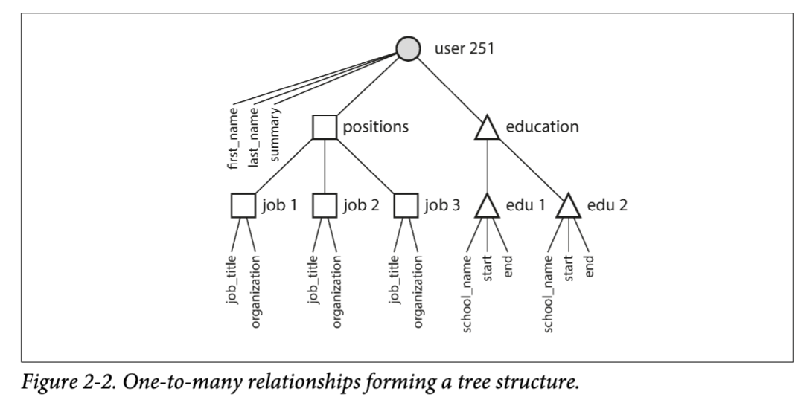
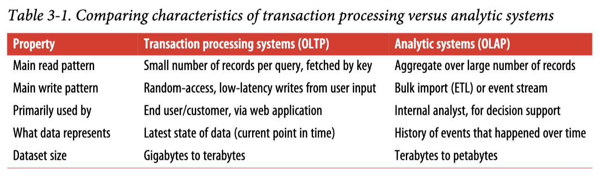

# Chapter 1: Reliable, Scalable, and Maintainable Applications
- Reliability in a system is ensuring it works correctly, even when things go wrong
    1. A reliable system is fault-tolerant and resilient
    2. Resilience means how capable a system of recovering from failure
    3. Fault-tolerance means how capable a system is of avoiding faults
    4. Faults can be hardware, software, and human-made
    5. Faults are prevented, but rendered impossible, through redundancy, testing, observability, isolation, and etc
- Scalabiliy measures how easy it is to scale a system when traffic increases dramatically
    1. Load is measured through load parameters such as read/write ratio on a database, number of requests per second on a web server, number of hits on a cache, and etc
    2. Twitter needed to handle read and write load from getting and posting tweets with respect to followers
        - Twitter's first method was to store tweets, users, and follower (many-to-many table) as relational tables linked by foreign keys, which meant read performance suffered due to many joins while write performance was solid due to a single write destination
        - However, Twitter's get tweet rate was 2x greater in magnitude (100x) than their post tweet rate, so they leveraged a cache for each individual user and home timeline feeds for each user; this reduced read speed but decreased write speed due to writes in multiple destinations
        - Some celebrities are followed by millions, so updating the cache for each of these users is impossibly slow, and so Twitter uses a combination of both methods, reserving SQL joins for users with large followings
    3. After load parameters are established, measure performance when load is increased using measures such as CPU usage, response time, memory usage, and etc.
        - A common performance metric is median response time, as the median represents the 50th percentile
        - The xth percentile states that x% of response times occur in < xth percentile and 100 - x% occur in > xth percentile
        - Amazon measures on the 99.9th percentile (tail latency), which means that it accounts for the 99.9% response time in a sorted list and ensures even the 99.9th percentile is under a certain SLA to satisfy large customer orders
        - Amazon did not go to 99.99th percentile, because the cost of maintaining this would far outweigh the benefits
- Maintainability measures how easy it is to fix bugs, upkeep performance, add features, and etc
    1. It consists of operability, simplicity, and evolvability
    2. Operability measures how easy it is to keep system running smoothly, and can be enhanced using monitoring, high visibility, self-healing, and etc
    3. Simplicity measures the lack of unnecessary complexity of a system, and can be improved using proper abstractions
        - A trivial example is using C++ as an abstraction of assembly to write a server process
    4. Evolvability measures agility on a data system

# Chapter 2: Data Models
- A data model is an abstract framework that defines how data is organized, structured, and manipulated within a system, specifying the relationships between data elements and how they are stored, accessed, and updated at various levels, from high-level conceptual entities to low-level physical storage formats
    1. It can be conceptual, high-level such as representing customers or orders
    2. It can be logical, specifying how the data will be structured without going into physical implementation; think table schemas
    3. It can be physical, which is how the data is actually going to look like on a machine
- Relational databases have been the primary logical data model for decades, but NoSQL offers a more scalable, distributed, and non-forming schema way of persisting data
- Applications are written in OOP where each entity is a type, and ORMs are used to translate relational tuples into application objects
- Certain types of data are not suited for a relational database's logical data model such as resumes; here, a NoSQL document store would be better
    1. 
    2. 
    3. The relationships above are one-to-many, or one-to-one, which implies a tree structure a JSON logical model can easily handle
    4. The JSON logical model offers better locality because no joins are needed to retrieve data
    5. The region_id and industry_id are stored as IDs and referenced by a foreign key in another table even though they have one-to-one relationship and could be stored as text; this is an edge case where the resume should have standardized lists of regions and industries
        - Offers ease of updating
        - Offers better search because the region table can encode additional information such as the state the region is in
        - This is a deliberate removal of duplication choice (normalization), where human-meaningful information is not duplicated and only the ID is
- However, once many-to-one or many-to-many relationships exist, a join is required regardless of the logical data model, so relational data model is better suited as it supports normalization and joins
    1. In NoSQL, data is either duplicated (denormalized) or joined in application code using references for many-to-one or many-to-many relationships
- Without considering concurrency handling, scalability, and fault-tolerance, choosing between document and relational databases comes down to the underlying logical data model
    1. If data has tree-like structure (one-to-one or one-to-many), then a document model is simpler
    2. If data has many-to-one or many-to-many relationships, it is better to shift responsibility of joining to the database rather than application code
    3. If data structure constantly changes or there are many types of objects that require an excessive amount of tables, then the schema-less document database is better because migrations are slow due to data copying
    4. Data locality is stronger in document stores because a document can represent all nested information under one single continuous string such as JSON, XML, or BSON whereas disk seeks are required for cross-table joins
    5. Data locality only applies when large documents are required by application, because updating a large document requires rewriting the document again; thus, document stores recommend smaller documents
- Popular database offerings are merging the lines between document and relational logical data models, and applications typically require a hybrid if their data persistence needs are rich and complex
- Relational databases use SQL, a declarative programming language
    1. Declarative means expressing the pattern or access, updating, or retrieval whereas imperative requires line-by-line code logic such as looping, updating variables, and etc
    2. The query optimizer is what controls what happens under the hood, and by limiting what a user can do declaratively, optimizers can rely on a set of assumptions to function
- MapReduce is a programming paradigm that uses map and reduce operations, and this is implemented by some databases
    1. It is neither declarative or imperative but somewhere in between
    2. It is good for distributed batch processing of data, but MongoDB supports a limited extension if scale data processing is needed
    3. SQL can be written as a series of low-level MapReduce operations but not all database engines use this implementation
- FINISH GRAPH DB SECTION

# Chapter 3: Storage and Retrieval
## Data Structures That Power Your Database
- The physical data model for databases concerns how data is stored on disk and how indexes are managed (on-disk or in-memory depending on implementation)
- Logs are append-only data structures containing a sequence of records, but reading is O(N) due to linear scan
- Using indexes can speed up reads at the cost of write speed
- Key-value log data can benefit from hashmap indexes
    1. Maintain a hashmap mapping key to latest byte offset (location of latest key in log file)
    2. Good when writes are high as log will grow fast in size which will slow reads, and there are only a few keys because the index is stored in-memory
    3. When log takes up too much disk space, break up log by writing to another log file, and then perform compaction between segments, which merges keys to represent the latest one
    4. Deletion in a log requires appending a deletion record called a tombstone, which is picked up during compaction to ignore the tombstone's key
    5. In-memory hashmap index are ephmeral, so snapshot each segment's hash map on disk periodically, and restore + update when process starts again after a shut down
    6. No range queries are supported with hashmap index
    7. Supports a single writer thread because multiple writer threads will break ordering unless synchronized
    8. Supports concurrent reads because log files are append-only and existing records are immutable
- SSTables are log files that maintain key rodering
    1. Each segment file is sorted by key, hence sorted string table (SSTable)
    2. Use a merge sort to compact adjacent segment files, taking the key in the most recent segment file if there is a key tie
    3. Reading requires only storing a handful of keys in hashmap index (one key per few kilobytes of data in a segment file), and traversing from the largest key <= target key and up to smallest key > target key; this greatly reduces memory usage of index
    4. Writing requires using a balanced BST such as red-black or AVL trees (memtable), and persisting the ordered data on disk when tree becomes too large, and finally resetting the memtable for further writes
    5. Using SSTables can form a simple database system
        a. Initialize database process, which maintains a balanced BST and hashmap index
        b. Upon write request, write to balanced BST but if tree exceeds size threshold, create a new segment file with ordered data and reset tree; also update index
        c. Upon read request, check if key is in tree, then in the most recent segment using index, then in the next most recent segment, and etc
        d. Periodically run a compaction process to combine segment files, delete obsolete files, and remove deleted keys
        e. Memtable and hashmap index are ephemeral, so use redundancy by storing their contents on disk for restoration
- The pattern of maintaining and compacting SSTables for data persistence is called an LSM-tree
- B-trees are the on-disk indexes and pages are the on-disk data storage mechanism for relational databases
    1. B-trees break database into fix-sized pages, which are on-disk blocks of data containing keys, pointers to other pages, or values
    2. Pages implicitly compose a b-tree; b-trees are not separate entities but rather just a logical view of how to organize pages
    3. Each page contains a continuous range of keys, references to child pages, or values if leaf page
    4. The keys are ordered, and references contain child pages with keys in the parent range
    5. Number of references in a page is called branching factor
    6. Updating value requires navigating to correct page in O(log(N)) and changing value
    7. Creating new key requires finding a leaf page whose range encompases the new key; if the leaf page is full, split it into two half-full leaf pages, and update all parent pages who might be affected
    8. Writes can update existing keys or add new ones, and so to make the database resilient to crashes, a write-ahead log (WAL) stores every B-tree modification before it is applied to the pages for tree restoration
    9. For concurrency, locks are needed to avoid race conditions when accessing B-tree
- LSM-trees and B-trees both persist data in some ordered manner but they have differences
    1. LSM-trees have faster writes due to append-only log as the disk structure, but slower reads due to potentially scanning through every segment file
    2. B-trees have slower writes due to tree traversal but have faster reads due to tree traversal
- In databases, additional secondary indexes can be created, and B-trees or LSM-trees can be used as secondary indexes because they are k-value 
- To store values within the index, it is more efficient to have keys map to references of where the data is, which is the heap file
    1. Prevents data duplication because multiple indexes might reference the same data if secondary indexes are created
    2. If value is updated, the heap file can just be updated and all index references don't have to change, unless the update is too large and the heap file needs to be rewritten
- Heap files are used for nonclustered index and not for clustered index
    1. Noncluster means values are stored as references to location on disk within the index
    2. Cluster means values are stored directly within the index
- Concatenated indexes create a tuple as a key based on multiple column values, and they can either be cluster or non-cluster
    1. If (A, B), queries or joins using A or A, B are effective but not B itself due to no inherent primary ordering on B 

## Transaction Processing or Analytics?
- OLTP stands for online transaction processing and is the typical access pattern for general user applications
- OLAP stands for online analytic processing and is the typical access pattern for analytics such as statistical aggregation for reports and business intelligence
- 
- Performing OLAP operations on a transaction database puts unnecessary stress and safety concerns, so a data warehouse is used to periodically extract read-only data from transaction databases
    1. The process is called ETL
- OLAP access patterns require a diffrent set of index implementation to be efficient
- OLAP logical data models are often relational because SQL is good for statistical aggregation; but the physical data model is much different than that of transactional databases
- The schema for OLAP is usually "star schema" where records such as events are the primary table, and information is referenced in fact tables (one-to-one relationship); "snowflake schema" is just more granular fact tables broken down into further one-to-one tables
- OLAP data warehouses are column-oriented in terms of physical data model to make analytical queries efficient because they typically need to process entire columns rather than fetch every single row
    1. Cassandra has the idea of column families but this is a separate notion from column-oriented; it is still mostly row-oriented
    2. This makes entire column reads extremely fast, but slows down writes because each column file is
- A materialized view is a table-like object whose contents are the results of some query, acting as a cache for aggregates such as COUNT, SUM, AVG, and etc
    1. READ UP ABOUT VIEWS AND MATERIALIZED VIEWS

# Chapter 4: Encoding and Evolution
## Formats for Encoding Data
- Backward compatibility means newer code can read data that was written by older code (easier to achieve by keeping old code around); forward compatability means older code can read data written by newer code ( harder to achieve)
    1. Relationship between one process that serializes and another that deserializes
- Data is either kept in-memory using data structures such as objects, structs, lists, and etc or encoded as a sequence of bytes in a format, JSON for example, if sent over network or written to disk
- Translation from native programming language's in-memory representation to a transmittable or persistable byte sequence is called encoding, serialization, or marshaling and the opposite is called decoding, parsing, deserialization, and unmarshalling
- Programming language's have their own encoding/decoding package/module/library but it is native to that programming language and can be slow
- Data serialization consists of serialization format + serialization scheme
    1. An example is JSON + UTF-8 or ASCII
    2. An example is protobuf + protobuf wire format 
- Standardized serialization formats are JSON, XML, and CSV which are string formats
    1. Cannot distinguish number and string in CSV or XML
    2. Cannot distinguish integers and floats in JSON
    3. Cannot store binary encodings because UTF-8 does not support this representation; thus, no images, videos, or audio can exist in these formats because only strings can be stored in these formats
- For binary serialization, Apache Thrift and protobuf formats can be used, which use their native binary protocols as the serialization scheme
    1. Define a schema
    2. Use code generation tool to create classes that perform serialization and deserialization from and into native programming language structures
    3. The tag numbers allow for field identification during encoding/decoding
        a. This allows Thrift and protobuf to maintain forward compatability if new field tags are added because they are just ignored by older encoders/decoders
        b. Backwards compatability is easy as well because original field tags are still there for newer code to process; however new fields can never be required anymore because old formats do not have that field and a runtime error will be thrown
- Avro is another binary serialization but type information is not included in the binary encoding, so to decode, the exact same schema that encoding uses is also used to decode
    1. As such, Avro uses the writer schema and the reader schema to determine how to handle changes
    2. Forward compatability means new writer schema and old reader schema; backward compatability means new reader schema and old writer schema
    3. The lack of field IDs make Avro efficient for representing database schema changes and dynamically generated schemas
- Most relational databases have a network protocol that possesses their own native, proprietary binary encoding format and scheme
## Modes of Dataflow
- Whenever data needs to be shared with a separate process, which doesn't share memory (only threads do), data serialization and deserialization is needed, regardless of over network or over disk
- For databases, if the database schema is updated, the change needs to be handled in application code in order to gaurantee forwards and backwards compatability
    1. Old data will stay in the database until a request comes in with updated application logic, which will rewrite the stale data new data
- In microservice architecture, old and new versions of services should still be compatible in terms of the data they exchange
- When passing data through networks, the method differs based on the encoding used
    1. For instance, gRPC uses protobuf
    2. RESTful APIs typically use JSON over HTTP
        a. REST does not mean JSON nor does it mean HTTP, but it is most commonly implemented using them
    3. RPCs abstract away the underlying network protocol, whereas REST doesn't, and this transparency can help with debugging
- Asynchronous message-passing systems are somewhere between RPC and databses, and is powered by a message broker
- Message brokers offer several advantages over direct RPC/REST
    1. It can act as a buffer if recipient is overloaded or unavailable
    2. It allows one message to be sent to several consumers
    3. Decouples the sender from the recipient
    4. Brokers can manage multiple queues/topics and can support pub/sub or point-to-point and other additional features; message queues are just simple queue-like structures
- Message-passing is one-way in taht a sender doesn't normally expect a reply to its messages

- Questions: Read up on a SQL indexing guide so we can understand the relationships between B-tree, pages, heap files, cluster (ordered), noncluster (nonordered), and all other intricacies. 
- Many-to-many, many-to-one, one-to-many are clear normaliation candidates. One-to-one must be normalized IF entity A has entity B, and entity B carries additiona columns with it